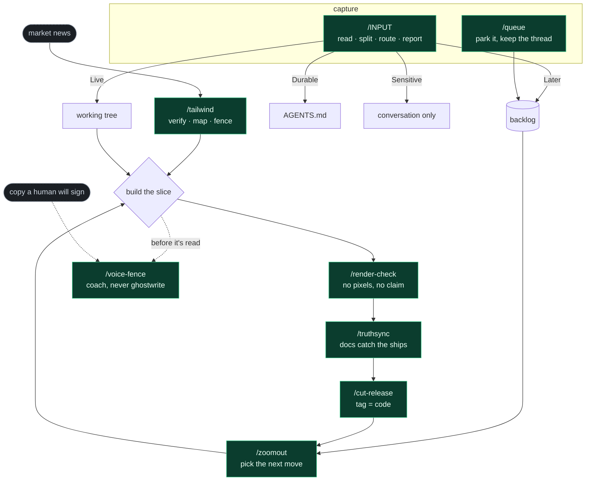

# skills

Agent skills by [Eric Lovold](https://github.com/ericlovold), founder of [Sanction](https://getsanction.com) — the authorization layer for AI agents.

[](https://skills.sh/ericlovold/skills)

## Install

```bash
npx skills add ericlovold/skills            # pick from the list
npx skills add ericlovold/skills --skill voice-fence
```

## The loop

They're not eight separate tricks — they're one working loop. Capture on the
left, a build-and-ship spine down the middle, and `voice-fence` off to the
side, guarding anything about to be read as *you*.



*(`cherry-pick` filters external content into the same routing spirit as
`/INPUT` — feed it, keep only what moves the current work.)*

## Skills

### voice-fence

The AI never writes in your voice. On anything another human will read as
*you* — posts, outreach, emails, booking pages, bios — the agent coaches
strategy, structure, and pressure-testing, and never drafts the words.

Born from one standing instruction: "don't write in my voice." The guardrail
is prose, not code. What you get back instead of a draft: audience strategy,
a beat/job/guidance structure table, medium constraints (truncation lines,
scan behavior), raw material, and a critique loop for the draft you write.

### cherry-pick

Filter a pasted block of external content — a Perplexity answer, another LLM
session, a research dump — down to only what improves the *current* project.
Anchors on what you're building, atomizes the block into candidates, judges
each against a bar (novel, on-goal, feasible, valid), and routes every one to
KEEP, VERIFY, or DROP. The drop list is a first-class output: you see what was
cut and why. Default verdict is drop — inclusiveness is failure.

### zoomout

The between-arcs ritual. When a work arc closes and the next move is unclear,
the agent rebuilds the map from live state — git, open PRs, README, roadmap,
changelog — cross-checks them for drift, then delivers a ranked board:
where we are, what drifted, open loops, next best actions (one marked as the
recommendation), and what's explicitly deferred. Ends in a decision, not a
summary.

### queue

Capture the mid-arc thought without losing the arc. One line to
`docs/BACKLOG.md`, dated, in the user's own words, phrased safe-for-public
when the repo is public — then straight back to the interrupted work. The
backlog drains through planning passes, never through the capture itself.

### input

Ingestion with judgment, where `queue` is capture without it. Feed in a block
of raw material you vouch for — strategy, sprint output, a snippet, live
coding suggestions — and the agent reads the whole thing, splits it into
pieces, and routes each to where it lives: applied to the working tree,
queued to the backlog, proposed as a durable instruction, or held in the
conversation if it's sensitive. Wrong-for-this-codebase pieces get pushed
back with a reason. Ends in a per-piece disposition report — nothing fed in
is ever silently dropped. (Named for Number 5 in *Short Circuit*; it ships
with a small "INPUT!" flourish that never gets in the way of the report.)

### cut-release

The release ritual, so version and tag can't drift apart. Verify what's
actually tagged vs what's on main, bump the version and stamp the changelog
as their own PR that merges *before* the tag, then hand over release notes
and a prefilled publish link, and verify Latest after publish. Every count in
the notes is checked against the code, not the draft.

### render-check

No pixels, no claim. Before asserting any UI change works, seed the data the
page needs, boot the dev server, screenshot the named pages with a headless
browser, and attach the evidence — then read it yourself. A visual claim
without a screenshot is a cheap lie; this makes the proof one word.

### truthsync

Drain the drift between what shipped and what the docs say. Diff merged work
since the last release against the truth surfaces — changelog, roadmap,
README, glossary, traceability — and propose the catch-up as one docs-only
PR, every count verified against code. A zoom-out detects the drift; this
fixes it. Run it before every release cut.

### tailwind

The market-event playbook. When news drops — a platform launch, a protocol
shift — verify it at primary sources, map it onto your product's primitives
and roadmap, and ship a fenced same-day slice if one exists (or degrade
gracefully to a mapping plus a captured backlog arc). Hold the mandate, not
the rail. Ends by flagging the go-to-market moment the event just opened.

### pushback

An agreeable AI is a yes-man with infinite stamina. Before executing a
nontrivial direction — a rewrite, a migration, a "let's just..." — the agent
steelmans the idea, argues the strongest honest case against it, names the
trade-off of every path including doing nothing, and lands a verdict: GO,
GO-IF, or STOP. One pass, then full commitment — no relitigating after the
user decides.

Born from a standing instruction: "push back when something is a bad idea,
and name the trade-off." A solo founder has no staff engineer whose job is
to say "that won't work." This is that job.

### decided

Decisions don't stay decided — the choice survives in the code, the
*reasoning* evaporates, and the same question comes back a month later.
Logs each real decision to `docs/DECISIONS.md` with the why, the alternative
that lost, and a revisit-when condition. When a settled topic reopens, the
agent quotes the log back and asks one question: "what changed?" If nothing
changed, the decision stands. Sibling of queue; zoomout reads the file.

### preship

The reviewer a solo founder doesn't have. Before anything irreversible or
public goes out — a deploy, a release, a customer email, a live pricing
change — one adversarial pass on the exact artifact, running the checks a
missing reviewer, editor, QA, and ops person would have run. Findings point
at the artifact, five ranked maximum, ending in SHIP, SHIP-AFTER, or HOLD.
Depth calibrates to blast radius: a prod migration and a tweet are not the
same review.

## License

MIT
